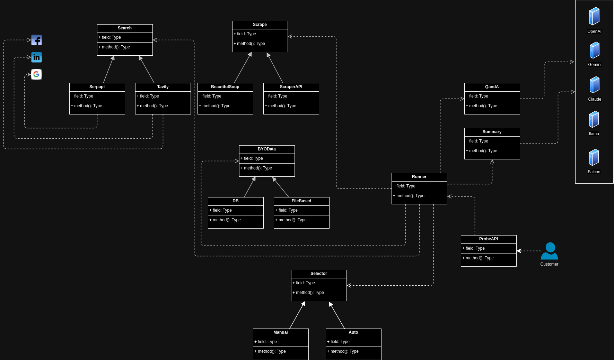

**Project Name:** Probe AI  
**Version:** 1.0  
**Company:** EigenAI  
---
## 1. Introduction
**Probe AI** is a powerful platform that leverages advanced AI and machine learning (ML) technologies to help businesses extract valuable insights from both public and private customer data. It enables efficient data collection, integration, analysis, and summary generation for a wide range of applications such as targeted marketing, credit risk assessment, job fitment, and more. The platform utilizes scraping tools, LLMs (Large Language Models), and customer-specific data sources to generate actionable insights, all while ensuring data security and compliance.

## 2. Objectives
- **Enable Comprehensive Profile Searches**: Users can search for public and private profiles (e.g., social media, certifications) and request access to proprietary data sources.
- **Provide Scraping Capabilities**: Extract relevant data using free and paid scraping tools.
- **Support "Bring Your Own Data"**: Clients can connect their internal data systems (files, databases) to the platform.
- **Summarize Data Effectively**: Utilize LLMs to generate clear and actionable insights from the data.
- **Answer Customer-Specific Questions**: The platform uses LLMs to answer specific queries related to customer data, such as risk assessment or job fitment.

## 3. Scope of the Project
### In Scope:
1. Profile searches across public and private data sources.
2. Data scraping tools (both free and paid).
3. Integration with customer databases and file systems (BYOD).
4. LLM-powered summarization and insight generation.
5. Q&A functionality powered by LLMs.
6. Certification for accessing customer data.
7. Data protection compliance and security measures.

### Out of Scope:
1. Building external data scraping APIs.
2. User interface design (UI) for customers.
3. Customer-specific consultations (e.g., marketing strategies).
4. Direct financial transactions or partnerships for certifications.

---

## 4. Functional Requirements

### 4.1 Search for Profile
1. **Description**: 
   - Users can search for public profiles across various data sources (LinkedIn, GitHub, etc.) or request private customer data.
   - Customers can choose between public or private data sources and will need appropriate certifications for private data access.
2. **Certification Options**: 
   - **GDPR Compliance Certification**: For accessing personal data within the EU.
   - **CCPA Compliance Certification**: For accessing personal data in California.
   - **OAuth Token-based Certification**: For third-party platforms like LinkedIn, Google.
   - **Industry-Specific Certifications**: e.g., **Financial Services Certification** for accessing credit data.
   - **Certification Tools**:
     - **Compliance Tools**: Integrations with **OneTrust**, **TrustArc** for GDPR/CCPA compliance.
     - **OAuth Tools**: Use **Authlib** or **OAuthlib** for managing OAuth tokens.

### 4.2 Scraping Data
1. **Description**: 
   - Data scraping involves gathering relevant information from public and paid sources based on customer preferences.
2. **Scraping Tools**:
   - **Free Tools**:
     - **BeautifulSoup**: For parsing HTML and XML.
     - **Selenium**: For scraping dynamic content (e.g., JavaScript-rendered pages).
     - **Scrapy**: A Python framework designed for large-scale web scraping.
   - **Paid Tools**:
     - **PhantomBuster**: Social media scraping, including LinkedIn.
     - **Apify**: Web scraping service with pre-built crawlers for many platforms.
     - **BrightData (Luminati)**: Provides paid proxies for scraping.
3. **Data Storage**:
   - Scraped data will be stored in structured formats like **SQL databases** (MySQL/PostgreSQL) or **JSON files** for further processing.

### 4.3 Bring Your Own Data (BYOD)
1. **Description**: 
   - Customers can upload their own data (CSV, Excel, etc.) or connect their internal data systems (databases, CRMs).
2. **Integration Tools**:
   - **Database Integration**:
     - **SQLAlchemy**: Python ORM to connect and extract data from SQL databases.
     - **Pandas**: For processing and manipulating file-based data (CSV, Excel).
     - **pyodbc**: Python package for connecting to SQL databases like MS SQL Server.
3. **Security Considerations**:
   - Ensure secure transmission and storage using **SSL/TLS encryption**.
   - Role-Based Access Control (RBAC) for data access permissions.

### 4.4 Summarize Data
1. **Description**:
   - After collecting data, Probe AI will summarize and present it in a clear, actionable format to answer customer-specific needs.
2. **LLM Tools**:
   - **OpenAI GPT-4**: For generating summaries and processing complex text queries.
   - **Hugging Face Transformers**: For fine-tuning models (BERT, GPT, etc.) to summarize customer-specific data.
3. **Data Summarization Libraries**:
   - **NLTK**, **spaCy**: For natural language processing tasks (tokenization, sentence parsing).
   - **Sumy**: Python library for automatic text summarization.
4. **Summary Customization**: 
   - Users can set preferences for summary length and detail.

### 4.5 Question and Answer (Q&A) Functionality
1. **Description**:
   - Users can ask specific questions related to their data, and Probe AI will use its LLM to generate insightful responses.
2. **Q&A Tools**:
   - **OpenAI GPT-4**: Integrated via Python SDK to process natural language queries.
   - **Haystack**: For building a custom Q&A system with retrievers and readers.
   - **Langchain**: A framework for building language-model-powered applications, ideal for Q&A functionality.

---

## 5. Non-Functional Requirements

### 5.1 Security and Data Protection
1. **Data Encryption**: 
   - All customer data should be encrypted both at rest (AES-256) and in transit (TLS 1.2+).
2. **Compliance**: 
   - The platform must comply with **GDPR**, **CCPA**, and other relevant data protection regulations.
   - **Audit Logs**: Keep logs of data access and actions for compliance and security auditing.
3. **Authentication and Authorization**:
   - Use **OAuth2** or custom username/password authentication.
   - Implement **Multi-Factor Authentication (MFA)** for sensitive actions.

### 5.2 Performance
1. **Scalability**:
   - The system should scale to handle thousands of queries per minute using technologies like **Docker** containers and **Kubernetes** orchestration.
2. **Response Time**:
   - The platform should answer queries within 2-3 seconds for a smooth user experience.

### 5.3 Availability
1. **System Uptime**: 
   - Target 99.9% uptime SLA.
2. **Backup and Recovery**: 
   - Ensure daily backups of critical customer data and the ability to restore from backups within 24 hours.
   
### 5.4 Deployment

The **Probe AI** platform is available in two deployment options: **SaaS (Software as a Service)** and **Custom Deployment**. Both deployment models cater to different customer needs based on their requirements for data handling, security, and cost considerations.

#### 5.4.1 SaaS Deployment
- **Description**: The SaaS deployment offers a cost-effective solution for businesses that can work within the platform's standard configuration and data integration tools. It is ideal for companies that are comfortable with cloud-based, multi-tenant environments and do not require hosting sensitive or proprietary information locally.
  
- **Cost Efficiency**: The SaaS model provides significant cost savings, as it is based on a subscription pricing model. Pricing varies based on the choice of tools, integration requirements, and the volume of data processed. It allows businesses to scale seamlessly without heavy upfront investments in infrastructure.
  
- **Features**:
  - **Multi-Tenant Cloud Environment**: Hosted on secure cloud platforms (AWS, Azure, GCP), providing high availability and auto-scaling.
  - **Pre-configured Integrations**: A range of ready-to-use integrations for various data sources and third-party services (e.g., LinkedIn, financial data sources).
  - **Data Security**: All data transmitted and stored on the cloud platform is encrypted using SSL/TLS and AES-256 encryption.
  - **No Maintenance**: The SaaS version is fully managed, ensuring automatic updates, security patches, and system health monitoring.

#### 5.4.2 Custom Deployment
- **Description**: The custom deployment option is designed for customers with more specific requirements, particularly for those needing to handle non-public or highly sensitive data. This option offers the flexibility of an on-premise or private cloud-based deployment, ensuring that data remains within the customer's control.

- **Use Case**: Custom deployment is the only option available for clients requiring complete control over their data due to regulatory, privacy, or operational needs. It also provides a tailored infrastructure for organizations with specialized integration requirements or for those who need to adhere to strict internal policies regarding data handling and security.
  
- **Features**:
  - **Private Hosting**: The solution can be deployed on the client’s private cloud (e.g., AWS, Azure, GCP) or on-premise infrastructure, giving customers full control over their data storage and processing.
  - **Tailored Configurations**: Custom tools, integrations, and specific security protocols can be implemented to meet unique client needs.
  - **Higher Security**: With full control over the deployment environment, the client can enforce stricter access control, data isolation, and monitoring policies.
  - **Compliance**: Suitable for organizations that need to comply with regional data protection regulations or industry-specific standards (e.g., HIPAA, PCI DSS).

- **Costs**: Custom deployment typically involves higher upfront costs due to infrastructure setup, additional customization, and maintenance. Ongoing operational costs depend on the scale and the complexity of the deployment, but it provides complete flexibility and data sovereignty.

#### 5.4.3 Decision Criteria
- **Choose SaaS**: If you require a cost-effective solution with minimal infrastructure overhead and can work within the platform’s standardized configuration and tools.
- **Choose Custom Deployment**: If your organization has specific security, compliance, or integration requirements, or if you handle sensitive, proprietary, or non-public data.
Both deployment options will ensure that the **Probe AI** platform delivers value according to your needs, with SaaS offering scalability and cost savings, and custom deployments providing full control and enhanced security.
---

## 6. Technical Architecture

### 6.1 Platform Architecture
- **Frontend (User Interface)**: Web-based interface for clients to interact with the platform.
- **Backend**: 
   - Python-based backend using frameworks like **Flask** or **FastAPI** for building RESTful APIs.
   - LLM and NLP processing powered by **PyTorch** and **Transformers** library.
- **Data Storage**: SQL or NoSQL databases (MySQL/PostgreSQL) for structured data and **Elasticsearch** for full-text search.
- **Security**: Implement SSL/TLS for secure communication and **JWT (JSON Web Tokens)** for secure user authentication.

## Architecture
